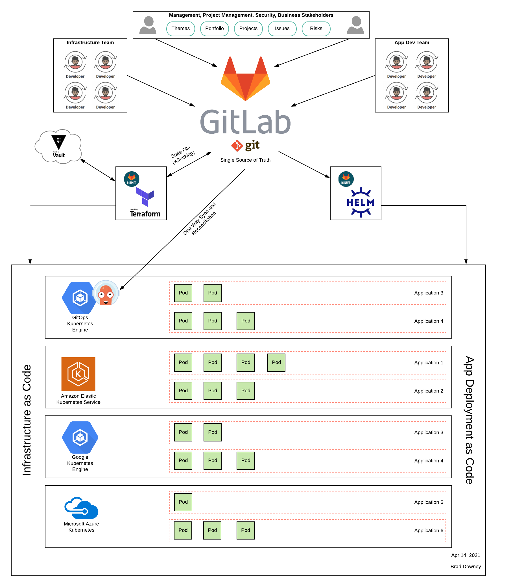

# GitOps

This example group is intended to show how to use `git` and GitLab as a single 
source of truth for Infrastructure and Application management.

### Group Structure
```
├─ gitops-demo
    ├── readme
    ├── gitlab-manage
    ├── apps
    |   ├── cluster-management
    |   ├── manifests
    │   ├── my-asp-net-app1
    │   ├── my-python-app4
    │   ├── my-ruby-app3
    │   └── my-spring-app2
    └── infra
        ├── aws
        ├── gcp
        ├── azure
        ├── kas-gcp
        └── templates
```

### Visual Representation


### Repository Purpose

*readme* - documentation of the gitops-demo group, and this file.

*gitlab-manage* - terraform code to represent the gitops-demo group configuration on gitlab.com.

*apps/\** - application and CI/CD code, one per application.

*apps/cluster-management* - project for installation of [GitLab Managed Applications, installed via CI/CD](https://docs.gitlab.com/ee/user/clusters/applications.html#install-using-gitlab-ci-alpha)

*infra/\** - terraform code to represent each cloud's configuration (vpc, security groups, and cluster configuration)

### Security
It's important to remember that secrets should never be placed into configuration files in the respository. Use of Environment Variables or Vault is recomended. 

Terrafrom has specific recomendations on sensitive information, such as data in state and plan files. Read more at the links below.
* https://www.terraform.io/docs/state/sensitive-data.html
* https://www.terraform.io/docs/commands/plan.html#security-warning

This project creates files that may contain sensitive information. Ensure your project does not expose these files to unauthorized persons. You can [restrict the visability](https://docs.gitlab.com/ee/user/project/settings/#sharing-and-permissions) of the CI/CD Pipelines to only project members. 


### To reproduce this demo within your own group
1. Fork the entire group structure into your own namespace:
   * You can use [Group Fork](https://gitlab.com/bdowney/gitlab-group-fork) to copy the entire group to a new namespace **OR** manually create group structure and clone projects.
   * You can then use [GitLab Cloner](https://gitlab.com/mtcs.io/gitlab-cloner) to download all projects locally.
1. You will need to find and replace `/gitops-demo/` with your new top level group.
TODO: Document each file location.

### Using Vault for Secrets
The `gitops-demo/infra/*` projects are using [Hashicorp Vault](https://www.vaultproject.io/) for secrets now. If you do not want to use Vault, see the next section on how to add secrets to Environment Variables.

Each secret needed (see below) is added to vault at the following locations and referenced by the `gitlab-ci.yml` file in each project. 
```
secret/infrastructure/aws
secret/infrastructure/gitlab
secret/infrastructure/gcp
secret/infrastructure/terraform
secret/infrastructure/azure
```

Example secret reference from `infra/aws/.gitlab-ci.yml`
```yaml
.secrets:
  secrets:
    AWS_ACCESS_KEY_ID_FILE:
      vault: infrastructure/aws/AWS_ACCESS_KEY_ID@secret
    AWS_SECRET_ACCESS_KEY_FILE:
      vault: infrastructure/aws/AWS_SECRET_ACCESS_KEY@secret
    AWS_REGION_FILE:
      vault: infrastructure/aws/AWS_REGION@secret
    GITLAB_TOKEN_FILE:
      vault: infrastructure/gitlab/GITLAB_TOKEN@secret

before_script:
  - export AWS_ACCESS_KEY_ID=$(cat $AWS_ACCESS_KEY_ID_FILE)
  - export AWS_SECRET_ACCESS_KEY=$(cat $AWS_SECRET_ACCESS_KEY_FILE)
  - export AWS_REGION=$(cat $AWS_REGION_FILE)
  - export GITLAB_TOKEN=$(cat $GITLAB_TOKEN_FILE)
```

### Using GitLab Environment Variables (in lieu of Vault Secrets)
1. Add the following Environment Variables to the `infra` group.

| Variable Name | Description |
| ------ | ------ |
| AWS_ACCESS_KEY_ID | EKS and VPC provisioning |
| AWS_SECRET_ACCESS_KEY | EKS and VPC provisioning |
| AWS_REGION | AWS Region for deployment |
| GITLAB_TOKEN | PAC To add K8s clusters to GitLab Group |
| GOOGLE_CREDENTIALS | GKE provisioning |
| GOOGLE_PROJECT | GKE provisioning |
| GOOGLE_REGION | GCP Region for deployment |
| ARM_SUBSCRIPTION_ID | AKS provisioning |
| ARM_CLIENT_ID | AKS provisioning |
| ARM_CLIENT_SECRET | AKS provisioning |
| ARM_TENANT_ID | AKS provisioning |

### Using GitLab for Terraform state management
Terraform state management is now using [GitLab itself](https://docs.gitlab.com/ee/user/infrastructure/index.html), this is an [Alpha Feature](https://docs.gitlab.com/ee/administration/terraform_state.html). 

*Using GitLab TF State*
Edit each `backend.tf` file to the proper url, including `project_id` in the url. 
```hcl
terraform {
  backend "http" {
  }
}
```

To `terraform init` the project locally, you need to use the following example to set the backend.
```bash
terraform init -reconfigure -upgrade \
    -backend-config="address=https://gitlab.com/api/v4/projects/14379212/terraform/state/production" \
    -backend-config="lock_address=https://gitlab.com/api/v4/projects/14379212/terraform/state/production/lock" \
    -backend-config="unlock_address=https://gitlab.com/api/v4/projects/14379212/terraform/state/production/lock" \
    -backend-config="username=bdowney" \
    -backend-config="password=$GITLAB_TOKEN" \
    -backend-config="lock_method=POST" \
    -backend-config="unlock_method=DELETE" \
    -backend-config="retry_wait_min=5"
```


If you are using the `.gitlab-ci.yml` [template in this group](https://gitlab.com/gitops-demo/infra/templates/-/blob/master/terraform.gitlab-ci.yml), you need to check the matching backend `script:` is being used in each job. 

```yaml
script:
    - *install-curl-jq
    - *gitlab-tf-backend  # Use this for GitLab TF State Backend
```


### Run the CI on each infra project to create the infrastructure.
Naviagate to each project in `/apps/`, select Ci/CD, and Run Pipeline for the `master` branch. This will build, test, and deploy each app to the kubernetes clusters created. 

### GitOps Agent
The [GitLab Kubernetes Agent](https://docs.gitlab.com/ee/user/clusters/agent/) is an active in-cluster component for solving GitLab and Kubernetes integration tasks in a secure and cloud-native way. Sometimes called ["Pull based GitOps"](https://www.gitops.tech/#pull-based-deployments). GitLab launched it's own [Kubernetes Agent](https://gitlab.com/gitlab-org/cluster-integration/gitlab-agent) based on the popular [GitOps Engine](https://github.com/argoproj/gitops-engine)

The project in `infra/kas-gcp` has terrform code to create a GKE cluster, register an agent with GitLab, and install the agent within the cluster. It pulls a configuration file from that same repository. That configuration file points to a project in `apps/manifests` that describes one of the applications to deploy. A single run of `terraform apply` will create the cluster and install the applications in a single run.

Updates to the application are then described in the manifest file; the agent will detect these changes and install the new container images. 

#### Clean up
1. To clean up the infrastructure, invoke the manual action for `destroy` on each of the infra projects.

