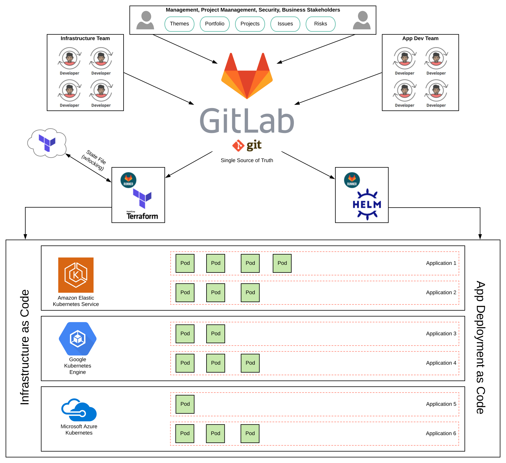
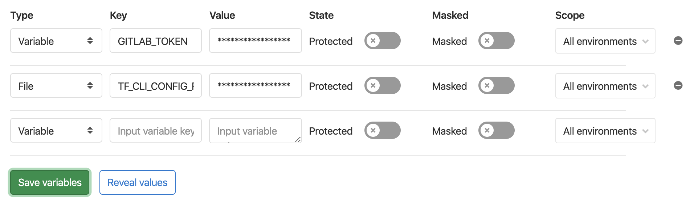

# GitOps

This example group is intended to show how to use `git` and GitLab as a single 
source of truth for Infrastructure and Application management.

### Group Structure
```
├─ gitops-demo
    ├── readme
    ├── gitlab-manage
    ├── apps
    │   ├── my-asp-net-app1
    │   ├── my-python-app4
    │   ├── my-ruby-app3
    │   └── my-spring-app2
    └── infra
        ├── aws
        ├── gcp
        ├── azure
        └── templates
```

### Visual Representation


### Repository Purpose

*readme* - documentation of the gitops-demo group, and this file.

*gitlab-manage* - terraform code to represent the gitops-demo group configuration on gitlab.com.

*apps/\** - application and CI/CD code, one per application.

*infra/\** - terraform code to represent each cloud's configuration (vpc, security groups, and cluster configuration)


### To reproduce this demo within your own group
1. Fork the entire group structure into your own namespace:
   * You can use [Group Fork](https://gitlab.com/bdowney/gitlab-group-fork) to copy the entire group to a new namespace **OR** manually create group structure and clone projects.
   * You can then use [GitLab Cloner](https://gitlab.com/mtcs.io/gitlab-cloner) to download all projects locally.
1. Create an organization (i.e. gitops-demo) and workspace named `gitlab-manage` on `https://app.terraform.io`. Change the Workspace Execution mode to `Local`
1. Within the [GitLab Manage](https://gitlab.com/gitops-demo/gitlab-manage) Project Settings:
    * Add an Environment Variable to this project called `GITLAB_TOKEN` with a personal access token with rights to the top level group.
    * Add an Environment File to this project called `TF_CLI_CONFIG_FILE` with the following format for a value.
        ```
        credentials "app.terraform.io" {token = "my-token-from-tf-cloud"}
        ```
    * 
    * Adjust the groups and user names in the *.tf files.
        * `backend.tf#4` 
        * `groups.tf#2`
        * `group_members.tf#2`
    * Run the CI pipeline on the `master` branch to deploy all the changes.
1. Clone all the projects into the proper groups.
1. Add the following Environment Variables to the `infra` group.

| Variable Name | 
| ------ | 
| AWS_ACCESS_KEY_ID | 
| AWS_REGION | 
| AWS_SECRET_ACCESS_KEY |
| GITLAB_TOKEN |
| GOOGLE_CREDENTIALS |
| GOOGLE_PROJECT |
| GOOGLE_REGION |
| TF_CLI_CONFIG_FILE |
| ARM_SUBSCRIPTION_ID |
| ARM_CLIENT_ID |
| ARM_CLIENT_SECRET |
| ARM_TENANT_ID |
| TF_VAR_client_id |
| TF_VAR_client_secret |

1. In your organization (i.e. gitops-demo) add workspaces named `aws`, `gcp`, and `azure` on `https://app.terraform.io`. Change the Workspace Execution mode to `Local` on all three.
1. Update `backend.tf` to match the orginization and workspace names created.
1. Run the CI on each infra project to create the infrastructure.
1. Run CI on each project to deploy each application. You may need to perform a [`terraform import`](https://www.terraform.io/docs/import/index.html) to match the manually created resources on the first run.

#### Clean up
1. To clean up the infrastructure, invoke the manual action for `destroy` on each of the infra projects.

